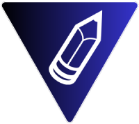

  

 <h1>Welcome to Memowave</h1>

## 🤩 Main Features 

- ✍️ **Full Text Editor:** Create notes with an powerful text editor.
- ☁️ **Cloud Sync:** Keep your notes safe and accessible from anywhere.
- 🚀 **More Features Coming Soon!** I'm working on new exciting features!

## 🤔 Why did I create this project? 

The main goal was to create my own tool to store notes and be able to access them from any device. 
Once the project is complete in a full and stable version, I would like other people to participate to improve it and turn it
into an Open-Source project, useful, powerful, attractive and above all, available and free for everyone.

So if you want to participate in any way, please contact me and let's make something great 🚀🚀.

## ⚠️ Important Notice 

This project is currently in development, and as such, it may not be secure enough for storing passwords or sensitive information. We do not recommend using it for such purposes until it reaches a stable release. 🙏🙏

## 💻 For Devs </>
### Run Locally

ℹ️ To run this project on your local machine, you need to install Docker and have a [Neon Database Serverless](https://neon.tech/) account.

1. Clone this repository
2. Run `npm i`
3. Install Docker on your machine
4. Copy `.env.example` to `.env`
5. Create a Neon Database Serverless account
6. Create a new project on Neon Database Serverless
7. Copy the connection string of your project
8. Replace `VITE_DATABASE_URL=` in `.env` with your connection string
9. Run `docker compose up -d` (lastest Docker versions)
10. Go to `http://localhost:3300` in your browser
11. Ready 🚀🚀

# Thanks for visit Memowave 😊.

### 🤝 Keep in touch
- [LinkedIn](https://www.linkedin.com/in/marcos-correa-larrosa)